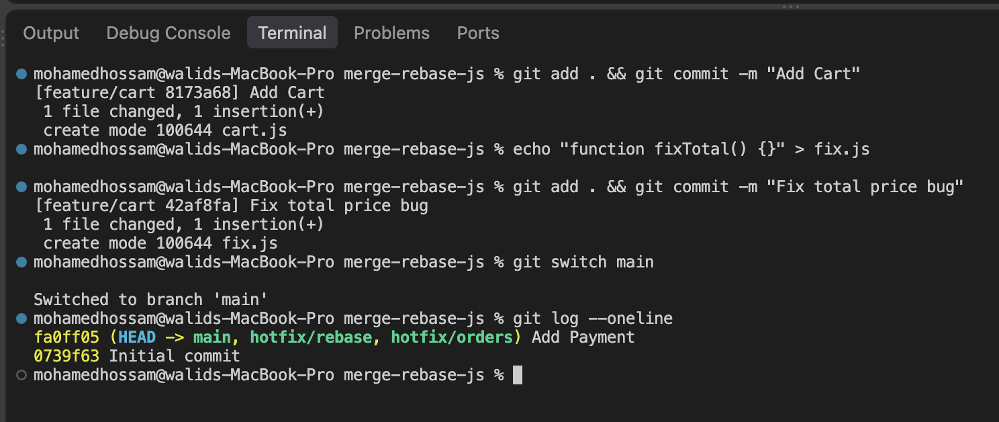
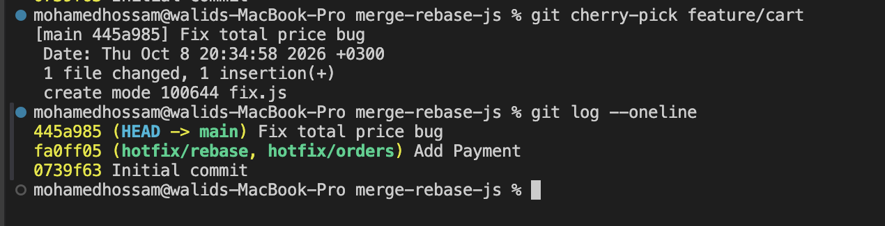

## git cherry-pick

ده الامر اللي باخد بيه commit واحد بس من branch واحطه في branch تاني، من غير ما اعمل merge لل branch كله

مثال
انا شغال علي feature/order ولسه مخلصتش، بس في النص عملت commit صلحت فيه bug في حساب ال total
ال bug ده موجود علي ال main كمان ولازم يتصلح دلوقتي، ومينفعش انزل ال feature كلها وهي لسه ناقصة

بجيب ال hash بتاع ال commit
```text
git log --oneline
```
وبعدين اروح ال main واخده
```text
git switch main
git cherry-pick a1b2c3d
```
كدا ال commit ده بس اتنسخ علي ال main، وباقي شغل ال feature لسه في مكانه

طب لو حصل conflict؟
بحله وبعدين
```text
git add .
git cherry-pick --continue
```
ولو عايز الغي
```text
git cherry-pick --abort
```

خلي بالك
ال commit بيتنسخ ب hash جديد، يعني بقي عندي نسختين منه، واحدة في كل branch

<p>
  
  
</p>
صورتين بيوضحوا ال main قبل وبعد ال cherry-pick
