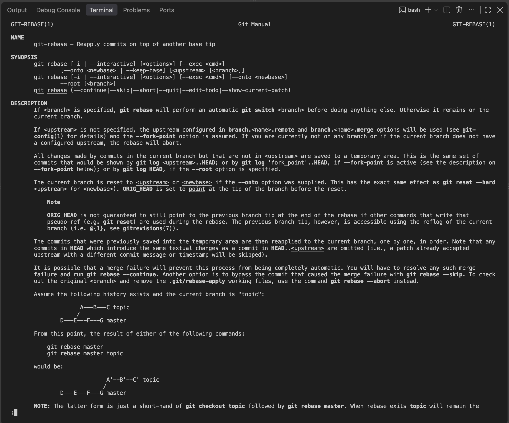
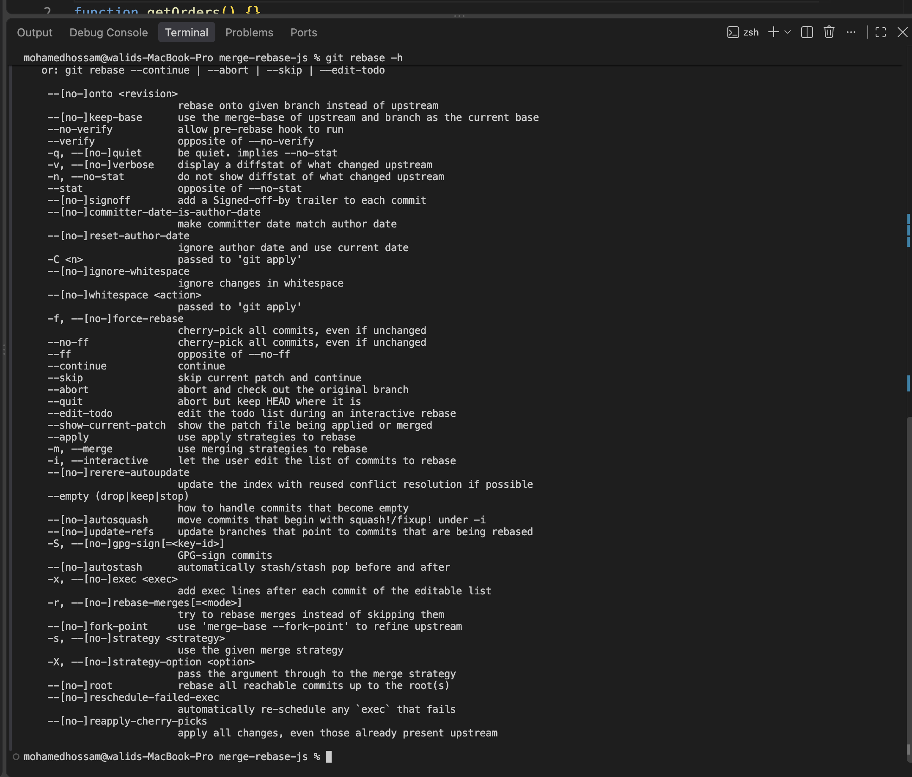
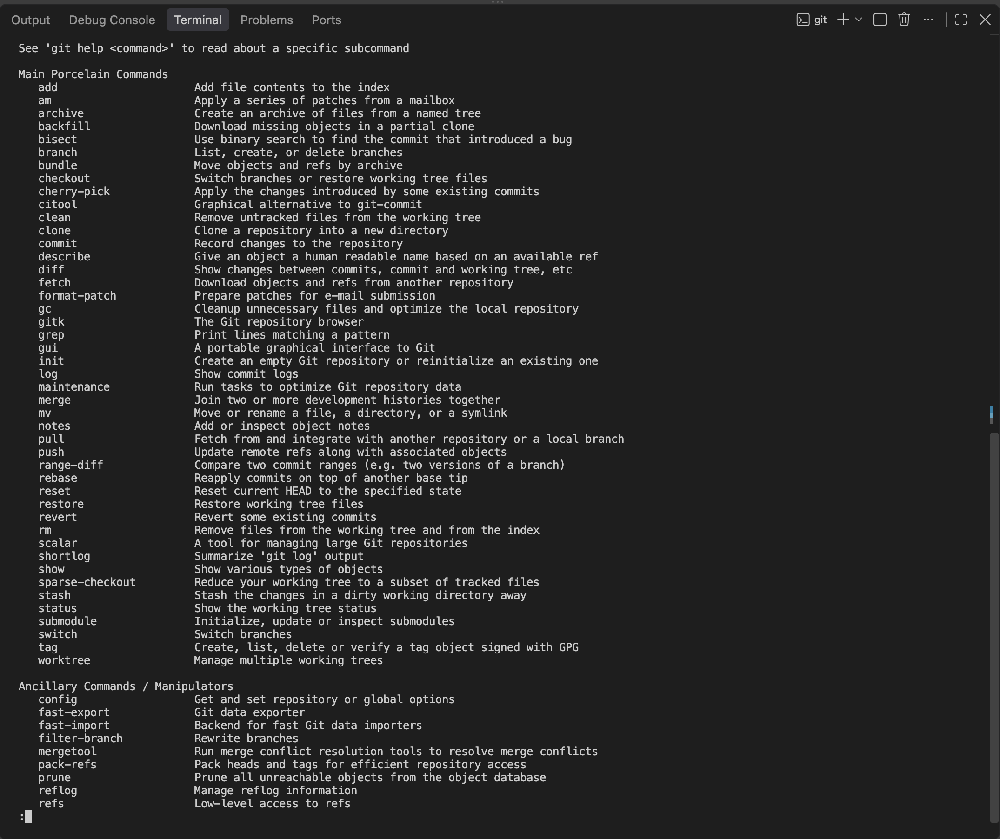
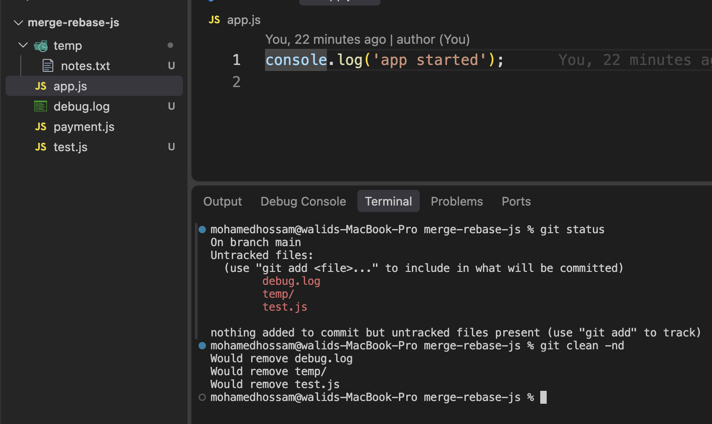
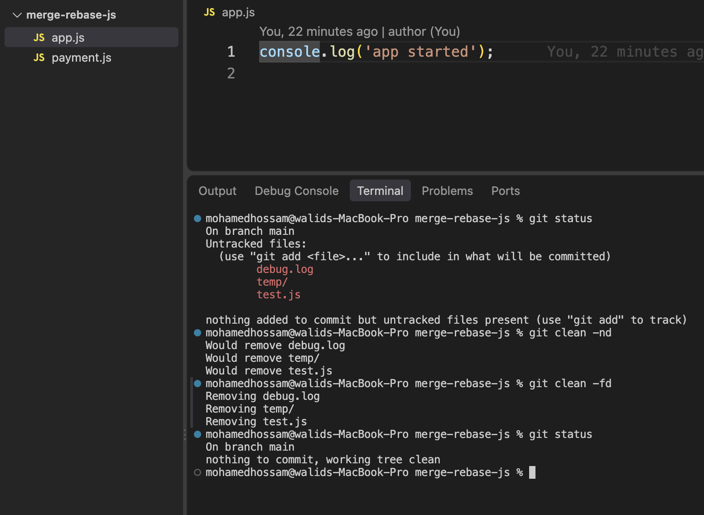
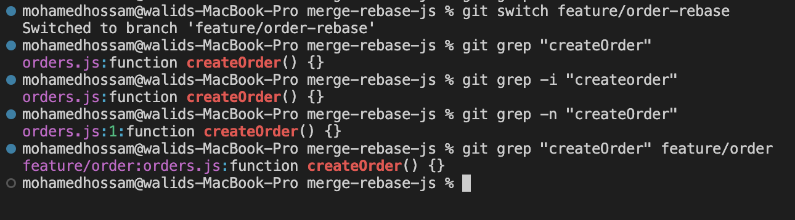

## git help

ده الامر اللي برجعله لما انسي امر معين بيتكتب ازاي او ال options بتاعته ايه
بدل ما اطلع من ال terminal وادور علي جوجل، ال git نفسه فيه ال documentation كاملة

مثال
انا عايز اشوف command معين زي ال git rebase
```text
git help rebase
```
ده بيفتحلي الشرح الكامل بتاع ال rebase بكل ال options والامثلة
وعشان اخرج منه بدوس q

طب لو مش عايز اقرا كل ده وعايز ملخص سريع؟
```text
git rebase -h
```
ده بيطلعلي ال options في كام سطر جوه ال terminal علي طول

طب لو مش فاكر اسم الامر اصلا؟
```text
git help -a
```
ده بيعرضلي كل اوامر ال git الموجودة

<p>
  
  
  
</p>

##
## git Clean


ده الامر اللي بيمسحلي  untracked files 
يعني الملفات اللي موجودة في الفولدر بس ال git لسه مش متابعها (معملتلهاش git add قبل كدا)

مثال
انا شغال علي ال order feature وكنت بجرب حاجات، فعملت ملفات مؤقتة زي test.js و debug.log وفولدر temp
خلصت تجربة ومش عايز اي حاجة منهم، وعايز ارجع المشروع نضيف زي ما كان

اول حاجة بشوف هو هيمسح ايه من غير ما يمسح فعلا
```text
git clean -n
```
ده بيعرضلي الملفات اللي هتتمسح بس

لو تمام ومتأكد
```text
git clean -f
```
ده بيمسح الملفات فعلا

طب والفولدرات؟
ال git clean لوحده مش بيمسح فولدرات، لازم ازود -d
```text
git clean -fd
```

طب لو عايز امسح كمان الملفات اللي في ال .gitignore زي node_modules او bin و obj؟
```text
git clean -fdx
```

خلي بالك
الملفات اللي بتتمسح ب git clean مش بتروح ال trash ومش بترجع تاني، عشان كدا لازم اجرب ب -n الاول

صورتين بيوضحوا الملفات اللي هتتمسح ب git clean -n وبعدين المسح الفعلي ب git clean -fd

<p>
  
  
</p>

##

## git grep

ده الامر اللي بدور بيه علي كلمة جوه كل ملفات المشروع
وهو بيدور في الملفات اللي ال git متابعها بس، عشان كدا سريع

مثال
انا عايز اغير اسم ال function اللي اسمها createOrder، وقبل ما اغيرها عايز اعرف هي مستخدمة فين
```text
git grep "createOrder"
```
 ده بيطلعلي اسم كل ملف فيه الكلمة ولو عايز رقم السطر بزود -n ولو مش فاكر هي capital ولا small؟ -i

<p>
  
</p>
