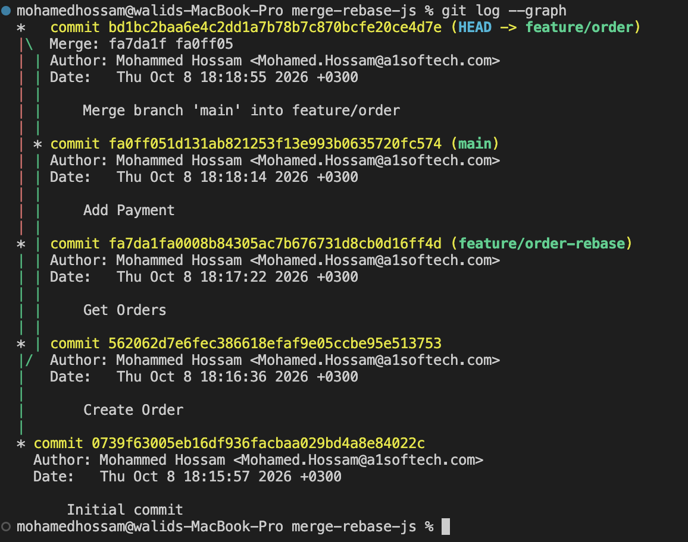
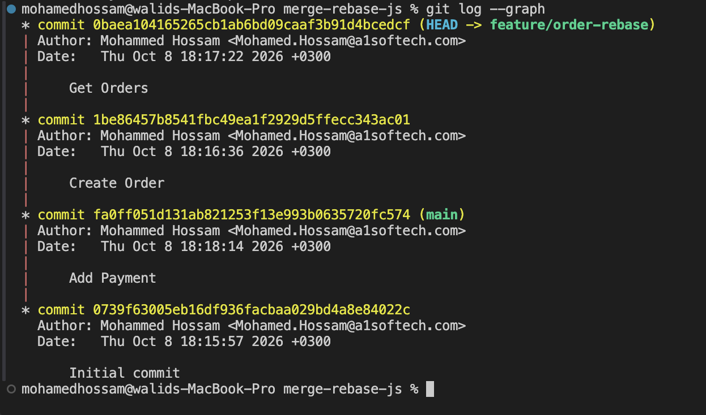

## git merge vs git rebase

الاتنين بيعملوا نفس الحاجة بجيب التغييرات اللي في branch واحطها في branch تاني
طب ايه الفرق؟
الفرق بيكون في شكل ال git history 
بعد ما العملية تخلص

مثال
انا شغال علي order feature علي branch اسمه feature/order وعملت
```text
git commit -m "Create Order"
git commit -m "Get Orders"
```
في نفس الوقت زميلي نزل commit جديد علي ال main
```text
git commit -m "Add Payment"
```
دلوقتي البرانش الاساسي فيه شغل مش عندي وعايز اجيبه عندي قبل ما افتح pull Request
قدامي طريقتين
اول حاجه git merge

```text
git switch feature/order
git merge main
```
هنا ال git بيضم شغل ال main علي شغلي وبيعمل commit جديد اسمه merge commit
وال commits القديمة بتفضل زي ما هي من غير اي تعديل

لو بصيت علي الhistory شوف الصورة الاولى باين ان كان في خطين ماشيين جنب بعض واتضموا في الاخر


ثاني حاجه معايا git Rebase 
```text
git switch feature/order
git rebase main
```
هنا ال git بيشيل ال commits بتاعتي ويحطها تاني فوق اخر commit في ال main، كأني بدأت شغلي بعد ما زميلي خلص

لو بصيت علي ال history هاتلاقي الصوره الثانية 
خط واحد مستقيم ومفيش merge commit

##صورتين بيوضحوا شكل ال history بعد ال merge وشكله بعد ال rebase
<p>
  
  
</p>
